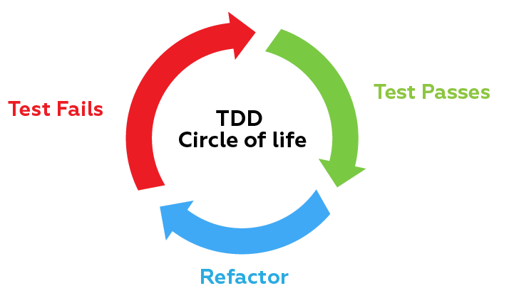
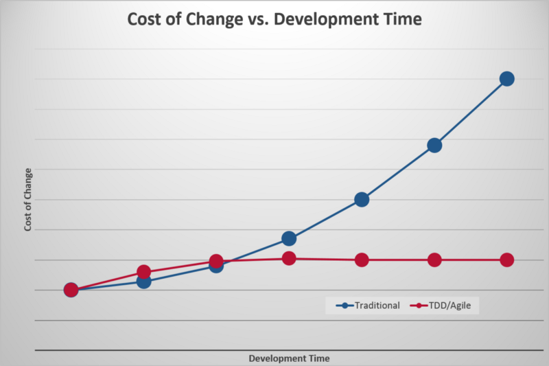

# TDD

Test-driven development (TDD) is a software development process relying on **software requirements** being converted to **test cases** <u>before software is fully developed</u>, and tracking all software development by repeatedly testing the software against all test cases. [Wikipedia](https://en.wikipedia.org/wiki/Test-driven_development)

## Architecture

The software architecture of a program or computing system is the structure or structures of the system, which comprise software elements, the externally visible properties of those elements, and the relationships among them. [IBM](https://www.ibm.com/developerworks/rational/library/feb06/eeles/index.html#:~:text=The%20software%20architecture%20of%20a,and%20the%20relationships%20among%20them.)

## Develop time

Isn’t Test Driven Development (TDD) twice the work? Should you do it anyway?

The short answer to the first question is NO. On the surface, it may seem like without TDD, time is only required to create the feature. With TDD, you need time to create the test AND create the feature, **thus doubling the development time required.**

What you’re not considering is the amount of time required for QA testing and debugging when the feature isn’t performing properly.

> Case studies were conducted with three development teams at Microsoft and one at IBM that adopted TDD. The results of the case studies indicated that the pre-release defect density of the four products decreased between 40% and 90% relative to similar projects that did not use the TDD practice.

When code is complicated, it gets much harder to get anything done — one little change over here can result in a big problem over there. When following TDD, developers can make changes with confidence and your QA team will catch fewer regressions. In development speak, “time saved is equal to money earned.”

[freecodecamp.org](https://www.freecodecamp.org/news/isnt-tdd-test-driven-development-twice-the-work-why-should-you-care-4ddcabeb3df9/)

## Example

### Story: Customer requests to save his location and see his cordinate 

##### Services involved
- Network
- Location

#### Narrative #1

As a user with no saved data.

I want to save my location coordinates

So I can see my last saved location.

##### Scenarios (Acceptance criteria)

**Given** the customer has internet conectivity and location enabled

**When** the customer push a save button

**Then** the app should save locally and remote the location

**And** display the location at that moment

**Given** the customer has internet conectivity and have location disabled

**When** the customer push s save button

**Then** the app should display a "Location is disabled" error message

**Given** the customer has no internet conectivity and location service is enabled

**When** the customer push a save button

**Then** the app should save localy the location and display the location

**Given** the customer has no internet conectivity and location service is disabled

**When** the customer push a save button

**Then** the app should display a "Location is disabled" error message.

#### Narrative #2

As a user with saved data.

I want the app to load my last saved location

So I can see my last saved location.

##### Scenarios (Acceptance criteria)

**Given** the customer has internet conectivity

**When** the app loads

**Then** the app should load remote data

**And** save localy the location

**And** display the location at that moment

**Given** the customer has no internet conectivity

**And** has local data

**Then** the app should display the location at that moment

**Given** the customer has no internet conectivity

**And** doesn't have local data

**Then** the app should display the message "Your last saved location can't be loaded"

### General Requirements

- If the application makes a network request, the user have to see a loading state.
- All the requirements of the Narrative #1 will be available on Narrative #2
